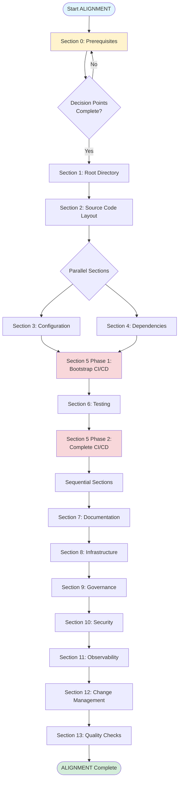

# ALIGNMENT Execution Flow

Visual guide showing the recommended order for implementing ALIGNMENT standards.

## Execution Flow Diagram

## Detailed Execution Steps

### Phase 1: Foundation (Sections 0-2)

1. **Section 0: Prerequisites**
   - Initialize Git repository
   - Choose package manager
   - Answer decision points
   - Document in `alignment-progress.json`

2. **Section 1: Root Directory Structure**
   - Create essential files (README, LICENSE, .gitignore)
   - Organize root directory (≤10 files)
   - Set up basic structure

3. **Section 2: Source Code Layout**
   - Organize source code (src/, cmd/, apps/, packages/)
   - Move files from root if needed
   - Establish directory structure

### Phase 2: Configuration (Sections 3-4) - Parallel

4. **Section 3: Configuration & Environment** (can run parallel with Section 4)
   - Set up .env.example
   - Configure secrets management
   - Set up pre-commit hooks

5. **Section 4: Dependency Management** (can run parallel with Section 3)
   - Verify lockfiles committed
   - Set up dependency scanning
   - Configure Dependabot/Renovate

### Phase 3: Automation Bootstrap (Section 5 Phase 1)

6. **Section 5 Phase 1: Bootstrap CI/CD**
   - Create basic CI/CD pipeline
   - Set up build and test steps
   - Configure basic security scanning

### Phase 4: Testing (Section 6)

7. **Section 6: Testing Structure**
   - Set up test framework
   - Organize test structure
   - Configure test coverage

### Phase 5: Complete Automation (Section 5 Phase 2)

8. **Section 5 Phase 2: Complete CI/CD**
   - Add test step to pipeline
   - Configure deployment
   - Set up advanced security scanning

### Phase 6: Documentation & Infrastructure (Sections 7-8)

9. **Section 7: Documentation Standards**
   - Complete README.md
   - Create CONTRIBUTING.md
   - Set up documentation structure

10. **Section 8: Infrastructure / IaC**
    - Organize infrastructure code
    - Set up environment separation
    - Document infrastructure

### Phase 7: Governance & Security (Sections 9-10)

11. **Section 9: Governance & Ownership**
    - Create CODEOWNERS
    - Define branching strategy
    - Set up code review standards

12. **Section 10: Security & Compliance**
    - Create SECURITY.md
    - Set up security scanning
    - Configure compliance checks

### Phase 8: Observability & Quality (Sections 11-13)

13. **Section 11: Observability & Monitoring**
    - Set up structured logging
    - Configure metrics
    - Create health checks

14. **Section 12: Change Management**
    - Set up CHANGELOG.md
    - Configure commit conventions
    - Set up versioning

15. **Section 13: Quality & Health Checks**
    - Set up quality metrics
    - Configure health scoring
    - Set up compliance validation

## Quick Reference

**Must Complete in Order:**
- Section 0 → Section 1 → Section 2
- Section 5 Phase 1 → Section 6 → Section 5 Phase 2
- Sections 7-13 (sequential)

**Can Do in Parallel:**
- Sections 3 and 4 (after Section 2)

**Checkpoints:**
- After Section 0: Decision points documented
- After Section 2: Source code organized
- After Section 5 Phase 1: Basic CI/CD working
- After Section 6: Tests passing
- After Section 13: Full alignment complete

## Time Estimates

- **Foundation (0-2):** 2-4 hours
- **Configuration (3-4):** 1-3 hours
- **Automation Bootstrap (5 Phase 1):** 1-2 hours
- **Testing (6):** 2-4 hours
- **Complete Automation (5 Phase 2):** 1-2 hours
- **Documentation & Infrastructure (7-8):** 3-6 hours
- **Governance & Security (9-10):** 3-5 hours
- **Observability & Quality (11-13):** 4-8 hours

**Total:** 17-34 hours for full alignment

**Minimum Viable Alignment (MVA):** ~90 minutes (Sections 0-1, basic CI/CD, security basics)
