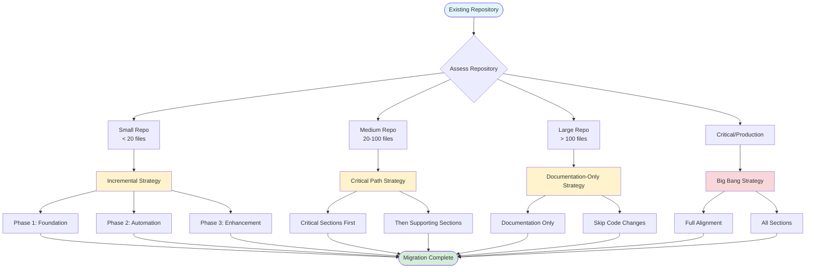
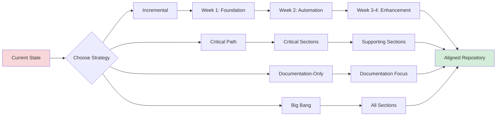

# ALIGNMENT Migration Paths

Visual guide for migrating existing repositories to ALIGNMENT standards.

## Migration Strategy Decision Tree

## Migration Strategies

### Strategy 1: Incremental (Recommended)

**Best for:** Small to medium repositories, gradual improvement

**Phases:**

#### Phase 1: Foundation (Week 1)
- Section 0: Prerequisites
- Section 1: Root Directory Structure
- Section 2: Source Code Layout
- Section 3: Configuration & Environment

#### Phase 2: Automation (Week 2)
- Section 4: Dependency Management
- Section 5: CI/CD Structure (Phase 1)
- Section 6: Testing Structure
- Section 5: CI/CD Structure (Phase 2)

#### Phase 3: Enhancement (Week 3-4)
- Section 7: Documentation Standards
- Section 8: Infrastructure / IaC
- Section 9: Governance & Ownership
- Section 10: Security & Compliance
- Section 11: Observability & Monitoring
- Section 12: Change Management
- Section 13: Quality & Health Checks

**Timeline:** 3-4 weeks
**Risk:** Low
**Disruption:** Minimal

### Strategy 2: Critical Path

**Best for:** Medium repositories, focus on essentials

**Critical Sections First:**
1. Section 0: Prerequisites
2. Section 1: Root Directory Structure
3. Section 2: Source Code Layout
4. Section 3: Configuration & Environment
5. Section 4: Dependency Management
6. Section 5: CI/CD Structure
7. Section 10: Security & Compliance

**Then Supporting Sections:**
- Section 6: Testing Structure
- Section 7: Documentation Standards
- Section 8: Infrastructure / IaC
- Section 9: Governance & Ownership
- Section 11: Observability & Monitoring
- Section 12: Change Management
- Section 13: Quality & Health Checks

**Timeline:** 2-3 weeks
**Risk:** Medium
**Disruption:** Moderate

### Strategy 3: Documentation-Only

**Best for:** Large legacy repositories, minimal code changes

**Focus Areas:**
- Section 0: Prerequisites (decision points)
- Section 1: Root Directory Structure (documentation files only)
- Section 7: Documentation Standards (comprehensive)
- Section 9: Governance & Ownership (processes)
- Section 12: Change Management (CHANGELOG)

**Skip:**
- Major code reorganization
- Infrastructure changes
- Full CI/CD overhaul

**Timeline:** 1-2 weeks
**Risk:** Very Low
**Disruption:** Minimal

### Strategy 4: Big Bang

**Best for:** New repositories, small teams, critical systems requiring full alignment

**Approach:**
- Complete all sections in order
- Full alignment in one effort
- Comprehensive testing
- Team coordination required

**Timeline:** 1-2 weeks (intensive)
**Risk:** High
**Disruption:** High (but temporary)

## Migration Flow Diagram

## Migration Checklist

### Pre-Migration

- [ ] Assess repository size and complexity
- [ ] Choose migration strategy
- [ ] Set up `alignment-progress.json`
- [ ] Create migration branch
- [ ] Communicate plan to team

### During Migration

- [ ] Complete Section 0 (decision points)
- [ ] Follow chosen strategy phases
- [ ] Update progress tracker
- [ ] Test after each section
- [ ] Document deviations

### Post-Migration

- [ ] Verify all sections complete
- [ ] Run validation scripts
- [ ] Update documentation
- [ ] Merge migration branch
- [ ] Celebrate! 🎉

## Rollback Procedures

**If migration fails:**

1. **Document what failed**
   - Which section?
   - What went wrong?
   - Impact assessment

2. **Revert changes**
   - Use git to revert section
   - Restore from backup if needed

3. **Adjust strategy**
   - Consider different approach
   - Break into smaller steps
   - Get help if needed

## Common Migration Challenges

### Challenge: Large Codebase
**Solution:** Use Documentation-Only strategy or Critical Path

### Challenge: Active Development
**Solution:** Use Incremental strategy, migrate in phases

### Challenge: Legacy Code
**Solution:** Focus on documentation and governance, skip major refactoring

### Challenge: Team Resistance
**Solution:** Start with low-risk sections, demonstrate value

### Challenge: Time Constraints
**Solution:** Use Minimum Viable Alignment (MVA) approach

## Success Metrics

Track migration success:

- [ ] All P0 sections complete
- [ ] Validation scripts pass
- [ ] Health score improved
- [ ] Team can work effectively
- [ ] Documentation complete
- [ ] CI/CD working
- [ ] Security scanning active

## References

- [Migration Guide](../getting-started/Migration-Guide.md) - Detailed migration instructions
- [Minimum Viable Alignment](../getting-started/Minimum-Viable-Alignment.md) - Quick start option
- [Execution Flow](./Execution-Flow.md) - Section execution order
