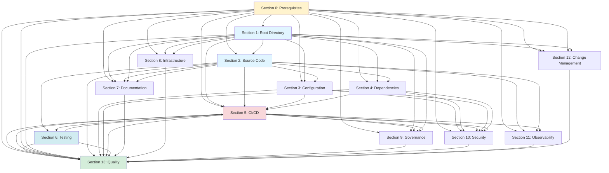

# ALIGNMENT Section Dependencies

Visual representation of dependencies between ALIGNMENT sections.

## Dependency Graph



## Dependency Matrix

| Section | Depends On | Required For |
|---------|-----------|-------------|
| 0: Prerequisites | None | All sections |
| 1: Root Directory | 0 | 2, 3, 4, 5, 7, 8, 9, 12 |
| 2: Source Code | 0, 1 | 3, 4, 5, 6, 7, 11, 13 |
| 3: Configuration | 0, 1, 2 | 5, 10, 13 |
| 4: Dependencies | 0, 1, 2 | 5, 10, 13 |
| 5: CI/CD | 0, 1, 2, 3, 4 | 6, 9, 10, 13 |
| 6: Testing | 2, 5 (Phase 1) | 5 (Phase 2), 13 |
| 7: Documentation | 0, 1, 2 | 13 |
| 8: Infrastructure | 0, 1 | 13 |
| 9: Governance | 0, 1, 5 (Phase 1) | 13 |
| 10: Security | 0, 3, 4, 5 (Phase 1) | 13 |
| 11: Observability | 0, 2, 5 (recommended) | 13 |
| 12: Change Management | 0, 1 | 13 |
| 13: Quality | All P0 sections | None |

## Critical Path

The critical path (minimum dependencies) for full alignment:

```
Section 0 (Prerequisites)
  ↓
Section 1 (Root Directory)
  ↓
Section 2 (Source Code)
  ↓
Section 3 (Configuration) ─┐
  ↓                        │
Section 4 (Dependencies) ──┤
  ↓                        │
Section 5 Phase 1 (Bootstrap CI/CD)
  ↓
Section 6 (Testing)
  ↓
Section 5 Phase 2 (Complete CI/CD)
  ↓
Section 7 (Documentation)
  ↓
Section 8 (Infrastructure)
  ↓
Section 9 (Governance)
  ↓
Section 10 (Security)
  ↓
Section 11 (Observability)
  ↓
Section 12 (Change Management)
  ↓
Section 13 (Quality)
```

## Parallel Execution Opportunities

**After Section 2:**
- Section 3 (Configuration) and Section 4 (Dependencies) can run in parallel

**After Section 5 Phase 2:**
- Sections 7-12 can be done in any order (though sequential is recommended)
- All feed into Section 13

## Prerequisite Checklist

Before starting each section, verify prerequisites:

### Section 1 Prerequisites
- [ ] Section 0 complete (decision points answered)

### Section 2 Prerequisites
- [ ] Section 0 complete
- [ ] Section 1 complete (root directory organized)

### Section 3 Prerequisites
- [ ] Section 0 complete
- [ ] Section 1 complete
- [ ] Section 2 complete (source code organized)

### Section 4 Prerequisites
- [ ] Section 0 complete
- [ ] Section 1 complete
- [ ] Section 2 complete

### Section 5 Prerequisites
- [ ] Section 0 complete
- [ ] Section 1 complete
- [ ] Section 2 complete
- [ ] Section 3 complete (for Phase 1)
- [ ] Section 4 complete (for Phase 1)
- [ ] Section 6 complete (for Phase 2)

### Section 6 Prerequisites
- [ ] Section 2 complete
- [ ] Section 5 Phase 1 complete

### Section 7 Prerequisites
- [ ] Section 0 complete
- [ ] Section 1 complete
- [ ] Section 2 complete

### Section 8 Prerequisites
- [ ] Section 0 complete
- [ ] Section 1 complete

### Section 9 Prerequisites
- [ ] Section 0 complete
- [ ] Section 1 complete
- [ ] Section 5 Phase 1 complete

### Section 10 Prerequisites
- [ ] Section 0 complete
- [ ] Section 3 complete
- [ ] Section 4 complete
- [ ] Section 5 Phase 1 complete

### Section 11 Prerequisites
- [ ] Section 0 complete
- [ ] Section 2 complete
- [ ] Section 5 recommended

### Section 12 Prerequisites
- [ ] Section 0 complete
- [ ] Section 1 complete

### Section 13 Prerequisites
- [ ] All P0 sections (0-12) complete

## Notes

- **Section 0** is the foundation for all other sections
- **Section 1** establishes the repository structure needed by most sections
- **Section 2** organizes code that will be tested, documented, and deployed
- **Section 5** has a two-phase approach due to circular dependency with Section 6
- **Section 13** depends on all previous sections for comprehensive quality checks
